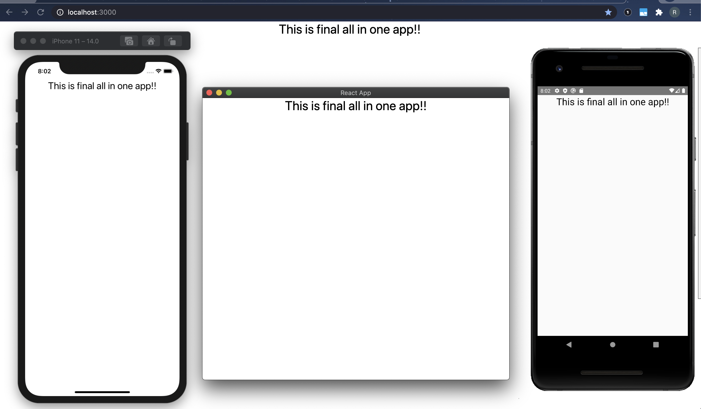

# About

This is starter app to help build react/react-native apps for Web, Mobile and Desktop (using Electron).

# Setup

1. Clone the repository `https://github.com/rinku-k/react-cross-platform-starter.git `
2. Run `yarn` or `npm install`
   You can optinally fork to keep the code base separate

# Demo screen

# Commands

- Web - `yarn web`
- Electron - `yarn electron`
- Android - `yarn start && yarn android`
- iOS - `yarn start && yarn ios`
